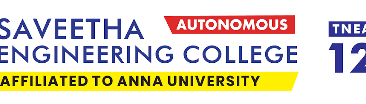
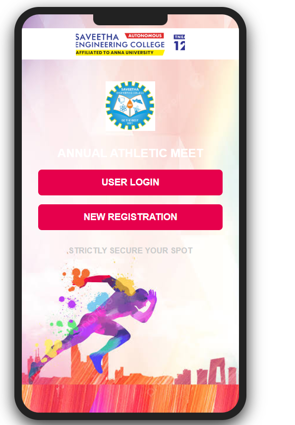
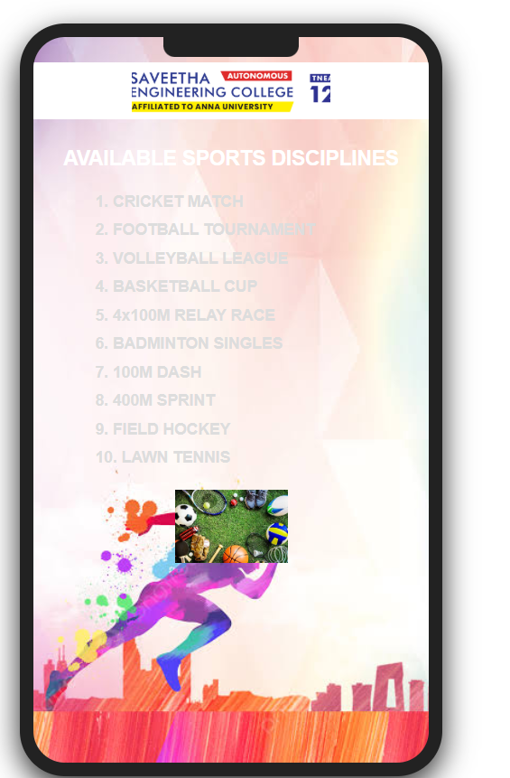
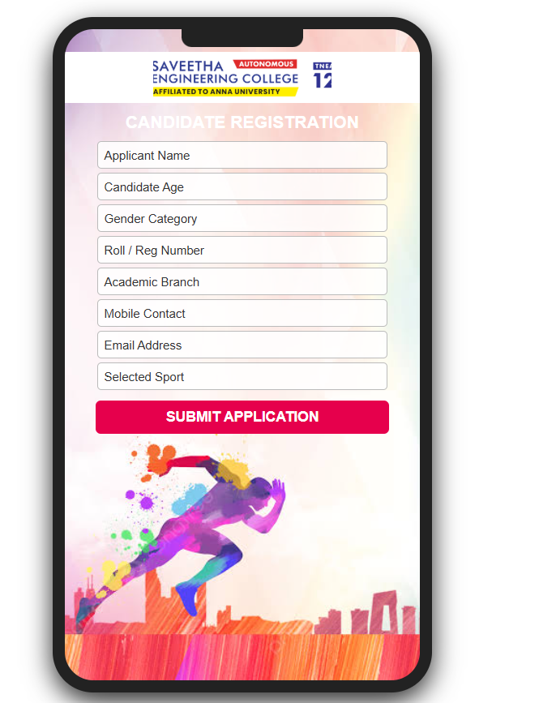
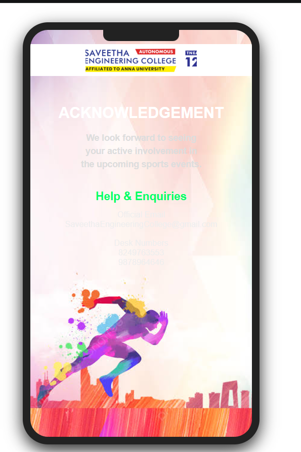

# Ex09 Event Registration Web Application
# Date:
# AIM:
To design, develop and deploy a web application for event registration.

# DESIGN STEPS:
## Step 1:
Create a new frame.

## Step 2:
Select any one preset size of your choice.

## Step 3:
Select the shapes you need.

## Step 4:
Import images as needed.

## Step 5:
Create pages based on your need and link them.

## Step 6:
Validate the HTML and CSS code.

## Step 6:
Publish the website in the given URL.

# DESIGN TOOL:
Figma

# CODE:
## Home
~~~

    

    
    

        
        
ANNUAL ATHLETIC MEET

        
USER LOGIN

        
NEW REGISTRATION

        
STRICTLY SECURE YOUR SPOT

    

~~~
## Event
~~~

    

    
    

        
AVAILABLE SPORTS DISCIPLINES

        

            1. CRICKET MATCH 
            2. FOOTBALL TOURNAMENT 
            3. VOLLEYBALL LEAGUE 
            4. BASKETBALL CUP 
            5. 4x100M RELAY RACE 
            6. BADMINTON SINGLES 
            7. 100M DASH 
            8. 400M SPRINT 
            9. FIELD HOCKEY 
            10. LAWN TENNIS
        

        
    

~~~
## Register
~~~

    

    
    

        
CANDIDATE REGISTRATION

        
Applicant Name

        
Candidate Age

        
Gender Category

        
Roll / Reg Number

        
Academic Branch

        
Mobile Contact

        
Email Address

        
Selected Sport

        
SUBMIT APPLICATION

    

~~~
## Contact
~~~
<!-- CONTACT US PAGE (contact.html) -->

    

    
    

        
ACKNOWLEDGEMENT

        
We look forward to seeing  your active involvement in   the upcoming sports events.

        
Help & Enquiries

        
Official Email SaveethaEngineeringCollege@gmail.com

        
Desk Numbers 8249763553 9878964646

    

~~~
# OUTPUT:
## Home

## Event

## Register

## Contact

# RESULT:
The program to design, develop and deploy a web application for event registration is completed successfully.
